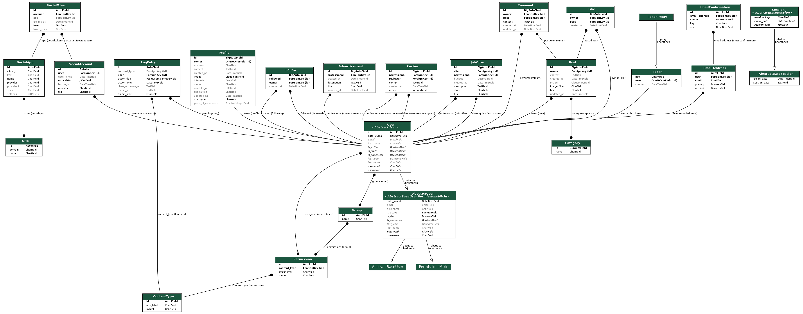

# [HAPPY CARPENTER API](https://happy-carpenter-ebf6de9467cb.herokuapp.com/)

[](https://github.com/ibra8080/happycarpenter/commits/main)
[](https://github.com/ibra8080/happycarpenter/commits/main)
[](https://github.com/ibra8080/happycarpenter)

Happy Carpenter API is the backend component of the Happy Carpenter project, a community platform for woodworking enthusiasts and professionals. This API provides the necessary endpoints and data management for the Happy Carpenter frontend application.


## Project Overview

Happy Carpenter consists of two main components:

1. Backend API: Developed using Django Rest Framework (This repository)
   - Repository: [Happy Carpenter API](https://github.com/ibra8080/happycarpenter)
   - Deployed at: [Here](https://happy-carpenter-ebf6de9467cb.herokuapp.com/)

2. Frontend Application: Built with React
   - Repository: [Happy Carpenter Frontend](https://github.com/ibra8080/happy-carpenter-front)
   - Deployed at: [Here](https://happy-carpenter-front-26472ba73a7c.herokuapp.com/)

This README focuses on the backend API, detailing its features, setup, and usage.


```
happycarpenter/
│
├── manage.py
├── requirements.txt
├── README.md
├── TESTING.md
│
├── happy_carpenter_api/
│   ├── __init__.py
│   ├── asgi.py
│   ├── authentication.py
│   ├── permissions.py
│   ├── serializers.py
│   ├── settings.py
│   ├── urls.py
│   ├── views.py
│   └── wsgi.py
│
├── authentication/
│   ├── __init__.py
│   ├── admin.py
│   ├── apps.py
│   ├── models.py
│   ├── serializers.py
│   ├── tests.py
│   ├── urls.py
│   └── views.py
│
├── profiles/
│   ├── __init__.py
│   ├── admin.py
│   ├── apps.py
│   ├── models.py
│   ├── serializers.py
│   ├── tests.py
│   ├── urls.py
│   └── views.py
│
├── posts/
│   ├── __init__.py
│   ├── admin.py
│   ├── apps.py
│   ├── models.py
│   ├── serializers.py
│   ├── tests.py
│   ├── urls.py
│   └── views.py
│
├── likes/
│   ├── __init__.py
│   ├── admin.py
│   ├── apps.py
│   ├── models.py
│   ├── serializers.py
│   ├── tests.py
│   ├── urls.py
│   └── views.py
│
├── follows/
│   ├── __init__.py
│   ├── admin.py
│   ├── apps.py
│   ├── models.py
│   ├── serializers.py
│   ├── tests.py
│   ├── urls.py
│   └── views.py
│
└── professionals/
    ├── __init__.py
    ├── admin.py
    ├── apps.py
    ├── models.py
    ├── serializers.py
    ├── tests.py
    ├── urls.py
    └── views.py
```

## Features

### Existing Features

- **User Authentication**
    - Handles user registration, login, and logout processes.
    - Implements JWT (JSON Web Tokens) for secure authentication.


- **User Profiles**
    - Manages user profile creation, retrieval, and updates.
    - Supports professional and amateur user types with different profile fields.


- **Posts Management**
    - Allows creation, retrieval, updating, and deletion of posts.
    - Supports image uploads for posts.


- **Comments System**
    - Enables users to comment on posts.
    - Provides endpoints for creating, retrieving, and managing comments.


- **Like Functionality**
    - Allows users to like and unlike posts.
    - Tracks and returns like counts for posts.


- **Follow System**
    - Enables users to follow and unfollow other users.
    - Provides endpoints to manage and retrieve follower/following relationships.


- **Search and Filter**
    - Implements search functionality for posts and users.
    - Supports filtering posts by various criteria (e.g., category, date).


- **Professional Features**
    - Manages professional user-specific features like service listings and reviews.


### Future Features

- Implement real-time notifications for user interactions.
- Add a messaging system for direct communication between users.
- Integrate a recommendation engine for personalized content suggestions.

## Technologies Used

- ⚠️⚠️ REQUIRED <-- delete me ⚠️⚠️
- [](https://tim.2bn.dev/markdown-builder) used to generate README and TESTING templates.
- [](https://git-scm.com) used for version control. (`git add`, `git commit`, `git push`)
- ⚠️⚠️ IDE: CHOOSE ONLY ONE <-- delete me ⚠️⚠️
- [](https://gitpod.io) used as a cloud-based IDE for development.
- ⚠️⚠️ LANGUAGES: CHOOSE ALL APPLICABLE <-- delete me ⚠️⚠️
- [](https://jquery.com) used for user interaction on the site.
- [](https://www.python.org) used as the back-end programming language.
- [](https://www.heroku.com) used for hosting the deployed back-end site.
- [](https://www.djangoproject.com) used as the Python framework for the site.
- [](https://dbs.ci-dbs.net) used as the Postgres database from Code Institute.
- [](https://cloudinary.com) used for online static file storage.
- [](https://whitenoise.readthedocs.io) used for serving static files with Heroku.
- [](https://chat.openai.com) used to help debug, troubleshoot, and explain things.

## Database Design

Entity Relationship Diagrams (ERD) help to visualize database architecture before creating models.
Understanding the relationships between different tables can save time later in the project.

🛑🛑🛑🛑🛑🛑🛑🛑🛑🛑 START OF NOTES (to be deleted)

Using your defined models (one example below), create an ERD with the relationships identified.

🛑🛑🛑🛑🛑🛑🛑🛑🛑🛑-END OF NOTES (to be deleted)

```python
class Product(models.Model):
    category = models.ForeignKey(
        "Category", null=True, blank=True, on_delete=models.SET_NULL)
    sku = models.CharField(max_length=254, null=True, blank=True)
    name = models.CharField(max_length=254)
    description = models.TextField()
    has_sizes = models.BooleanField(default=False, null=True, blank=True)
    price = models.DecimalField(max_digits=6, decimal_places=2)
    rating = models.DecimalField(
        max_digits=6, decimal_places=2, null=True, blank=True)
    image_url = models.URLField(max_length=1024, null=True, blank=True)
    image = models.ImageField(null=True, blank=True)

    def __str__(self):
        return self.name
```

🛑🛑🛑🛑🛑🛑🛑🛑🛑🛑 START OF NOTES (to be deleted)

A couple recommendations for building free ERDs:
- [Draw.io](https://draw.io)
- [Lucidchart](https://www.lucidchart.com/pages/ER-diagram-symbols-and-meaning)

A more comprehensive ERD can be auto-generated once you're
at the end of your development stages, just before you submit.
Follow the steps below to obtain a thorough ERD that you can include.
Feel free to leave the steps in the README for future use to yourself.

🛑🛑🛑🛑🛑🛑🛑🛑🛑🛑-END OF NOTES (to be deleted)

I have used `pygraphviz` and `django-extensions` to auto-generate an ERD.

The steps taken were as follows:
- In the terminal: `sudo apt update`
- then: `sudo apt-get install python3-dev graphviz libgraphviz-dev pkg-config`
- then type `Y` to proceed
- then: `pip3 install django-extensions pygraphviz`
- in my `settings.py` file, I added the following to my `INSTALLED_APPS`:
```python
INSTALLED_APPS = [
    ...
    'django_extensions',
    ...
]
```
- back in the terminal: `python3 manage.py graph_models -a -o erd.png`
- dragged the new `erd.png` file into my `documentation/` folder
- removed `'django_extensions',` from my `INSTALLED_APPS`
- finally, in the terminal: `pip3 uninstall django-extensions pygraphviz -y`


source: [medium.com](https://medium.com/@yathomasi1/1-using-django-extensions-to-visualize-the-database-diagram-in-django-application-c5fa7e710e16)


## Agile Development Process

### GitHub Projects

[GitHub Projects](https://github.com/ibra8080/happycarpenter/projects) served as an Agile tool for this project.
It isn't a specialized tool, but with the right tags and project creation/issue assignments, it can be made to work.

Through it, user stories, issues, and milestone tasks were planned, then tracked on a weekly basis using the basic Kanban board.

🛑🛑🛑🛑🛑🛑🛑🛑🛑🛑 START OF NOTES (to be deleted)

Consider adding a basic screenshot of your Projects Board.

🛑🛑🛑🛑🛑🛑🛑🛑🛑🛑-END OF NOTES (to be deleted)


## Agile Development Process

The development of the Happy Carpenter API followed an Agile methodology, utilizing GitHub's built-in features to manage the project:

### GitHub Projects

[GitHub Projects](https://github.com/ibra8080/happycarpenter/projects) was used as an Agile tool for this project. User stories, issues, and milestone tasks were planned and tracked using a basic Kanban board.


### GitHub Issues

[GitHub Issues](https://github.com/ibra8080/happycarpenter/issues) was used to create and manage user stories, bugs, and various tasks related to the project.

- [Open Issues](https://github.com/ibra8080/happycarpenter/issues)


- [Closed Issues](https://github.com/ibra8080/happycarpenter/issues?q=is%3Aissue+is%3Aclosed)


### MoSCoW Prioritization

The MoSCoW prioritization technique was applied to user stories:

- **Must Have**: Core features critical for the API's functionality
- **Should Have**: Important but not vital features
- **Could Have**: Desirable features that could improve user experience
- **Won't Have**: Acknowledged but not planned for the current iteration


## Testing

For all testing, please refer to the [TESTING.md](TESTING.md) file.

## Deployment

The live deployed application can be found deployed on [Heroku](https://happy-carpenter-ebf6de9467cb.herokuapp.com).

### Heroku Deployment

This project uses Heroku, a platform as a service (PaaS) that enables developers to build, run, and operate applications entirely in the cloud.

[Deployment steps and instructions...]


### Local Deployment

This project can be cloned or forked in order to make a local copy on your own system.

[Local deployment instructions...]


### Local VS Deployment

There are no known differences between the local version and the deployed version of this project.

## Credits

### Content

- The structure and implementation of the Django REST Framework API were inspired by the Code Institute's DRF tutorials.
- Additional Django and DRF concepts were learned from the official [Django documentation](https://docs.djangoproject.com/) and [DRF documentation](https://www.django-rest-framework.org/).

### Acknowledgements

- I would like to thank my Code Institute mentor, [Mentor Name], for their valuable feedback and guidance throughout the development of this project.
- The Code Institute Slack community for their support and advice.
- My family and friends for their patience and support during the development of this project.

