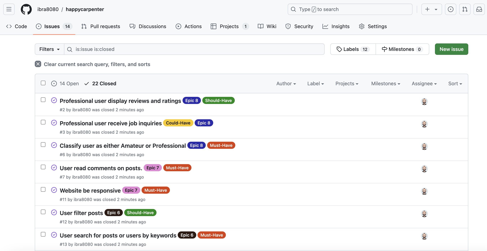

# [HAPPY CARPENTER API](https://happy-carpenter-ebf6de9467cb.herokuapp.com/)

[](https://github.com/ibra8080/happycarpenter/commits/main)
[](https://github.com/ibra8080/happycarpenter/commits/main)
[](https://github.com/ibra8080/happycarpenter)

Happy Carpenter API is the backend component of the Happy Carpenter project, a community platform for woodworking enthusiasts and professionals. This API provides the necessary endpoints and data management for the Happy Carpenter frontend application.


## Project Overview

Happy Carpenter consists of two main components:

1. Backend API: Developed using Django Rest Framework (This repository)
   - Repository: [Happy Carpenter API](https://github.com/ibra8080/happycarpenter)
   - Deployed at: [Here](https://happy-carpenter-ebf6de9467cb.herokuapp.com/)

2. Frontend Application: Built with React
   - Repository: [Happy Carpenter Frontend](https://github.com/ibra8080/happy-carpenter-front)
   - Deployed at: [Here](https://happy-carpenter-front-26472ba73a7c.herokuapp.com/)

This README focuses on the backend API, detailing its features, setup, and usage.


```
happycarpenter/
│
├── manage.py
├── requirements.txt
├── README.md
├── TESTING.md
│
├── happy_carpenter_api/
│   ├── __init__.py
│   ├── asgi.py
│   ├── authentication.py
│   ├── permissions.py
│   ├── serializers.py
│   ├── settings.py
│   ├── urls.py
│   ├── views.py
│   └── wsgi.py
│
├── authentication/
│   ├── __init__.py
│   ├── admin.py
│   ├── apps.py
│   ├── models.py
│   ├── serializers.py
│   ├── tests.py
│   ├── urls.py
│   └── views.py
│
├── profiles/
│   ├── __init__.py
│   ├── admin.py
│   ├── apps.py
│   ├── models.py
│   ├── serializers.py
│   ├── tests.py
│   ├── urls.py
│   └── views.py
│
├── posts/
│   ├── __init__.py
│   ├── admin.py
│   ├── apps.py
│   ├── models.py
│   ├── serializers.py
│   ├── tests.py
│   ├── urls.py
│   └── views.py
│
├── likes/
│   ├── __init__.py
│   ├── admin.py
│   ├── apps.py
│   ├── models.py
│   ├── serializers.py
│   ├── tests.py
│   ├── urls.py
│   └── views.py
│
├── follows/
│   ├── __init__.py
│   ├── admin.py
│   ├── apps.py
│   ├── models.py
│   ├── serializers.py
│   ├── tests.py
│   ├── urls.py
│   └── views.py
│
└── professionals/
    ├── __init__.py
    ├── admin.py
    ├── apps.py
    ├── models.py
    ├── serializers.py
    ├── tests.py
    ├── urls.py
    └── views.py
```

## Features

### Existing Features

- **User Authentication**
    - Handles user registration, login, and logout processes.
    - Implements JWT (JSON Web Tokens) for secure authentication.


- **User Profiles**
    - Manages user profile creation, retrieval, and updates.
    - Supports professional and amateur user types with different profile fields.


- **Posts Management**
    - Allows creation, retrieval, updating, and deletion of posts.
    - Supports image uploads for posts.


- **Comments System**
    - Enables users to comment on posts.
    - Provides endpoints for creating, retrieving, and managing comments.


- **Like Functionality**
    - Allows users to like and unlike posts.
    - Tracks and returns like counts for posts.


- **Follow System**
    - Enables users to follow and unfollow other users.
    - Provides endpoints to manage and retrieve follower/following relationships.


- **Search and Filter**
    - Implements search functionality for posts and users.
    - Supports filtering posts by various criteria (e.g., category, date).


- **Professional Features**
    - Manages professional user-specific features like service listings and reviews.


### Future Features

- Implement real-time notifications for user interactions.
- Add a messaging system for direct communication between users.
- Integrate a recommendation engine for personalized content suggestions.

## Technologies Used

- ⚠️⚠️ REQUIRED <-- delete me ⚠️⚠️
- [](https://tim.2bn.dev/markdown-builder) used to generate README and TESTING templates.
- [](https://git-scm.com) used for version control. (`git add`, `git commit`, `git push`)
- ⚠️⚠️ IDE: CHOOSE ONLY ONE <-- delete me ⚠️⚠️
- [](https://gitpod.io) used as a cloud-based IDE for development.
- ⚠️⚠️ LANGUAGES: CHOOSE ALL APPLICABLE <-- delete me ⚠️⚠️
- [](https://jquery.com) used for user interaction on the site.
- [](https://www.python.org) used as the back-end programming language.
- [](https://www.heroku.com) used for hosting the deployed back-end site.
- [](https://www.djangoproject.com) used as the Python framework for the site.
- [](https://dbs.ci-dbs.net) used as the Postgres database from Code Institute.
- [](https://cloudinary.com) used for online static file storage.
- [](https://whitenoise.readthedocs.io) used for serving static files with Heroku.
- [](https://chat.openai.com) used to help debug, troubleshoot, and explain things.

## Database Design

Entity Relationship Diagrams (ERD) help to visualize database architecture before creating models.
Understanding the relationships between different tables can save time later in the project.

```python
class Product(models.Model):
    category = models.ForeignKey(
        "Category", null=True, blank=True, on_delete=models.SET_NULL)
    sku = models.CharField(max_length=254, null=True, blank=True)
    name = models.CharField(max_length=254)
    description = models.TextField()
    has_sizes = models.BooleanField(default=False, null=True, blank=True)
    price = models.DecimalField(max_digits=6, decimal_places=2)
    rating = models.DecimalField(
        max_digits=6, decimal_places=2, null=True, blank=True)
    image_url = models.URLField(max_length=1024, null=True, blank=True)
    image = models.ImageField(null=True, blank=True)

    def __str__(self):
        return self.name
```

I have used `pygraphviz` and `django-extensions` to auto-generate an ERD.

The steps taken were as follows:
- In the terminal: `sudo apt update`
- then: `sudo apt-get install python3-dev graphviz libgraphviz-dev pkg-config`
- then type `Y` to proceed
- then: `pip3 install django-extensions pygraphviz`
- in my `settings.py` file, I added the following to my `INSTALLED_APPS`:
```python
INSTALLED_APPS = [
    ...
    'django_extensions',
    ...
]
```
- back in the terminal: `python3 manage.py graph_models -a -o erd.png`
- dragged the new `erd.png` file into my `documentation/` folder
- removed `'django_extensions',` from my `INSTALLED_APPS`
- finally, in the terminal: `pip3 uninstall django-extensions pygraphviz -y`


source: [medium.com](https://medium.com/@yathomasi1/1-using-django-extensions-to-visualize-the-database-diagram-in-django-application-c5fa7e710e16)


## Agile Development Process

### GitHub Projects

[GitHub Projects](https://github.com/ibra8080/happycarpenter/projects) served as an Agile tool for this project.
It isn't a specialized tool, but with the right tags and project creation/issue assignments, it can be made to work.

Through it, user stories, issues, and milestone tasks were planned, then tracked on a weekly basis using the basic Kanban board.


## Agile Development Process

The development of the Happy Carpenter API followed an Agile methodology, utilizing GitHub's built-in features to manage the project:

### GitHub Projects

[GitHub Projects](https://github.com/ibra8080/happycarpenter/projects) was used as an Agile tool for this project. User stories, issues, and milestone tasks were planned and tracked using a basic Kanban board.


### GitHub Issues

[GitHub Issues](https://github.com/ibra8080/happycarpenter/issues) was used to create and manage user stories, bugs, and various tasks related to the project.

- [Open Issues](https://github.com/ibra8080/happycarpenter/issues)


- [Closed Issues](https://github.com/ibra8080/happycarpenter/issues?q=is%3Aissue+is%3Aclosed)



### MoSCoW Prioritization

The MoSCoW prioritization technique was applied to user stories:

- **Must Have**: Core features critical for the API's functionality
- **Should Have**: Important but not vital features
- **Could Have**: Desirable features that could improve user experience
- **Won't Have**: Acknowledged but not planned for the current iteration

## Testing

For all testing, please refer to the [TESTING.md](TESTING.md) file.

## Deployment

The live deployed application can be found deployed on [Heroku](https://happy-carpenter-ebf6de9467cb.herokuapp.com).

### PostgreSQL Database

This project uses a [Code Institute PostgreSQL Database](https://dbs.ci-dbs.net).

To obtain my own Postgres Database from Code Institute, I followed these steps:

- Signed-in to the CI LMS using my email address.
- An email was sent to me with my new Postgres Database.

> [!CAUTION]  
> - PostgreSQL databases by Code Institute are only available to CI Students.
> - You must acquire your own PostgreSQL database through some other method
> if you plan to clone/fork this repository.
> - Code Institute students are allowed a maximum of 8 databases.
> - Databases are subject to deletion after 18 months.

### Cloudinary API

This project uses the [Cloudinary API](https://cloudinary.com) to store media assets online, due to the fact that Heroku doesn't persist this type of data.

To obtain your own Cloudinary API key, create an account and log in.

- For *Primary interest*, you can choose *Programmable Media for image and video API*.
- Optional: *edit your assigned cloud name to something more memorable*.
- On your Cloudinary Dashboard, you can copy your **API Environment Variable**.
- Be sure to remove the `CLOUDINARY_URL=` as part of the API **value**; this is the **key**.

### Heroku Deployment

This project uses [Heroku](https://www.heroku.com), a platform as a service (PaaS) that enables developers to build, run, and operate applications entirely in the cloud.

Deployment steps are as follows, after account setup:

- Select **New** in the top-right corner of your Heroku Dashboard, and select **Create new app** from the dropdown menu.
- Your app name must be unique, and then choose a region closest to you (EU or USA), and finally, select **Create App**.
- From the new app **Settings**, click **Reveal Config Vars**, and set your environment variables.

> [!IMPORTANT]  
> This is a sample only; you would replace the values with your own if cloning/forking my repository.

| Key | Value |
| --- | --- |
| `CLOUDINARY_URL` | user's own value |
| `DATABASE_URL` | user's own value |
| `DISABLE_COLLECTSTATIC` | 1 (*this is temporary, and can be removed for the final deployment*) |
| `SECRET_KEY` | user's own value |

Heroku needs three additional files in order to deploy properly.

- requirements.txt
- Procfile
- runtime.txt

You can install this project's **requirements** (where applicable) using:

- `pip3 install -r requirements.txt`

If you have your own packages that have been installed, then the requirements file needs updated using:

- `pip3 freeze --local > requirements.txt`

The **Procfile** can be created with the following command:

- `echo web: gunicorn app_name.wsgi > Procfile`
- *replace **app_name** with the name of your primary Django app name; the folder where settings.py is located*

The **runtime.txt** file needs to know which Python version you're using:
1. type: `python3 --version` in the terminal.
2. in the **runtime.txt** file, add your Python version:
	- `python-3.9.19`

For Heroku deployment, follow these steps to connect your own GitHub repository to the newly created app:

Either:

- Select **Automatic Deployment** from the Heroku app.

Or:

- In the Terminal/CLI, connect to Heroku using this command: `heroku login -i`
- Set the remote for Heroku: `heroku git:remote -a app_name` (replace *app_name* with your app name)
- After performing the standard Git `add`, `commit`, and `push` to GitHub, you can now type:
	- `git push heroku main`

The project should now be connected and deployed to Heroku!

### Local Deployment

This project can be cloned or forked in order to make a local copy on your own system.

For either method, you will need to install any applicable packages found within the *requirements.txt* file.

- `pip3 install -r requirements.txt`.

You will need to create a new file called `env.py` at the root-level,
and include the same environment variables listed above from the Heroku deployment steps.

> [!IMPORTANT]  
> This is a sample only; you would replace the values with your own if cloning/forking my repository.

Sample `env.py` file:

```python
import os

os.environ.setdefault("CLOUDINARY_URL", "user's own value")
os.environ.setdefault("DATABASE_URL", "user's own value")
os.environ.setdefault("SECRET_KEY", "user's own value")

# local environment only (do not include these in production/deployment!)
os.environ.setdefault("DEBUG", "True")
```

Once the project is cloned or forked, in order to run it locally, you'll need to follow these steps:

- Start the Django app: `python3 manage.py runserver`
- Stop the app once it's loaded: `CTRL+C` or `⌘+C` (Mac)
- Make any necessary migrations: `python3 manage.py makemigrations`
- Migrate the data to the database: `python3 manage.py migrate`
- Create a superuser: `python3 manage.py createsuperuser`
- Load fixtures (if applicable): `python3 manage.py loaddata file-name.json` (repeat for each file)
- Everything should be ready now, so run the Django app again: `python3 manage.py runserver`

#### Cloning

You can clone the repository by following these steps:

1. Go to the [GitHub repository](https://github.com/ibra8080/happycarpenter) 
2. Locate the Code button above the list of files and click it 
3. Select if you prefer to clone using HTTPS, SSH, or GitHub CLI and click the copy button to copy the URL to your clipboard
4. Open Git Bash or Terminal
5. Change the current working directory to the one where you want the cloned directory
6. In your IDE Terminal, type the following command to clone my repository:
	- `git clone https://github.com/ibra8080/happycarpenter.git`
7. Press Enter to create your local clone.

Alternatively, if using Gitpod, you can click below to create your own workspace using this repository.

[](https://gitpod.io/#https://github.com/ibra8080/happycarpenter)

Please note that in order to directly open the project in Gitpod, you need to have the browser extension installed.
A tutorial on how to do that can be found [here](https://www.gitpod.io/docs/configure/user-settings/browser-extension).

#### Forking

By forking the GitHub Repository, we make a copy of the original repository on our GitHub account to view and/or make changes without affecting the original owner's repository.
You can fork this repository by using the following steps:

1. Log in to GitHub and locate the [GitHub Repository](https://github.com/ibra8080/happycarpenter)
2. At the top of the Repository (not top of page) just above the "Settings" Button on the menu, locate the "Fork" Button.
3. Once clicked, you should now have a copy of the original repository in your own GitHub account!

### Local VS Deployment

There are no known differences between the local version and the deployed version of this project.

## Credits

### Content

- The structure and implementation of the Django REST Framework API were inspired by the Code Institute's DRF tutorials.
- Additional Django and DRF concepts were learned from the official [Django documentation](https://docs.djangoproject.com/) and [DRF documentation](https://www.django-rest-framework.org/).

### Acknowledgements

- I would like to thank my Code Institute mentor, [Mentor Name], for their valuable feedback and guidance throughout the development of this project.
- The Code Institute Slack community for their support and advice.
- My family and friends for their patience and support during the development of this project.
- A special acknowledgement to my new baby, born on 6.8.2024, who has been my biggest inspiration and motivation to complete this project.
