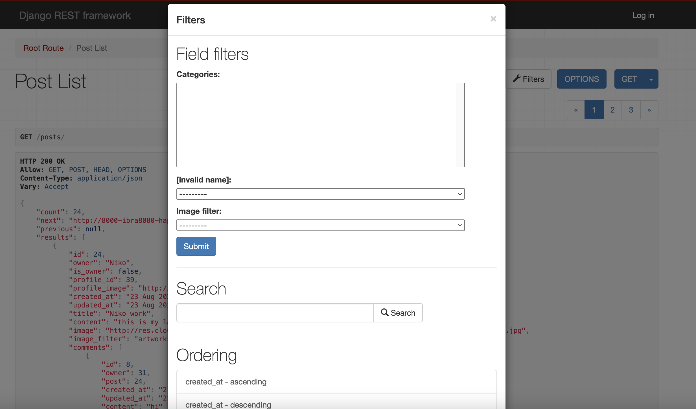

# [HAPPY CARPENTER API](https://happy-carpenter-ebf6de9467cb.herokuapp.com/)

Happy Carpenter API is the backend component of the Happy Carpenter project, a community platform for woodworking enthusiasts and professionals. This API provides the necessary endpoints and data management for the Happy Carpenter frontend application.

## Project Overview

Happy Carpenter consists of two main components:

1. Backend API: Developed using Django Rest Framework (This repository)
   - Repository: [Happy Carpenter API](https://github.com/ibra8080/happycarpenter)
   - Deployed at: [Here](https://happy-carpenter-ebf6de9467cb.herokuapp.com/)

2. Frontend Application: Built with React
   - Repository: [Happy Carpenter Frontend](https://github.com/ibra8080/happy-carpenter-front)
   - Deployed at: [Here](https://happy-carpenter-front-26472ba73a7c.herokuapp.com/)

This README focuses on the backend API, detailing its features, setup, and usage.

## Features

### Existing Features

- **User Authentication**
    - Handles user registration, login, and logout processes.
    - Implements JWT (JSON Web Tokens) for secure authentication.

- **User Profiles**
    - Manages user profile creation, retrieval, and updates.
    - Supports professional and amateur user types with different profile fields.

- **Posts Management**
    - Allows creation, retrieval, updating, and deletion of posts.
    - Supports image uploads for posts.

- **Comments System**
    - Enables users to comment on posts.
    - Provides endpoints for creating, retrieving, and managing comments.

- **Like Functionality**
    - Allows users to like and unlike posts.
    - Tracks and returns like counts for posts.

- **Follow System**
    - Enables users to follow and unfollow other users.
    - Provides endpoints to manage and retrieve follower/following relationships.

- **Search and Filter**
    - Implements search functionality for posts and users.
    - Supports filtering posts by various criteria (e.g., category, date).

- **Professional Features**
    - Manages professional user-specific features like service listings and reviews.

### Future Features

- Implement real-time notifications for user interactions.
- Add a messaging system for direct communication between users.
- Integrate a recommendation engine for personalized content suggestions.

## Technologies Used

- [Python](https://www.python.org/) for backend logic
- [Django](https://www.djangoproject.com/) as the web framework
- [Django REST Framework](https://www.django-rest-framework.org/) for building the API
- [PostgreSQL](https://www.postgresql.org/) as the database
- [Cloudinary](https://cloudinary.com/) for image storage and management
- [dj-rest-auth](https://dj-rest-auth.readthedocs.io/) for authentication endpoints
- [django-allauth](https://django-allauth.readthedocs.io/) for authentication, registration, and account management
- [django-cors-headers](https://github.com/adamchainz/django-cors-headers) for handling Cross-Origin Resource Sharing (CORS)
- [gunicorn](https://gunicorn.org/) as the WSGI HTTP Server
- [psycopg2](https://www.psycopg.org/) as the PostgreSQL adapter for Python
- [django-filter](https://django-filter.readthedocs.io/) for filtering querysets dynamically

## Agile Development Process

The development of the Happy Carpenter API followed an Agile methodology, utilizing GitHub's built-in features to manage the project:

### GitHub Projects

[GitHub Projects](https://github.com/ibra8080/happycarpenter/projects) was used as an Agile tool for this project. User stories, issues, and milestone tasks were planned and tracked using a basic Kanban board.

### GitHub Issues

[GitHub Issues](https://github.com/ibra8080/happycarpenter/issues) was used to create and manage user stories, bugs, and various tasks related to the project.

- [Open Issues](https://github.com/ibra8080/happycarpenter/issues)

- [Closed Issues](https://github.com/ibra8080/happycarpenter/issues?q=is%3Aissue+is%3Aclosed)

### MoSCoW Prioritization

The MoSCoW prioritization technique was applied to user stories:

- **Must Have**: Core features critical for the API's functionality
- **Should Have**: Important but not vital features
- **Could Have**: Desirable features that could improve user experience
- **Won't Have**: Acknowledged but not planned for the current iteration

## Testing

For all testing, please refer to the [TESTING.md](TESTING.md) file.

## Deployment

The live deployed application can be found deployed on [Heroku](https://happy-carpenter-ebf6de9467cb.herokuapp.com).

### Heroku Deployment

This project uses Heroku, a platform as a service (PaaS) that enables developers to build, run, and operate applications entirely in the cloud.

[Deployment steps and instructions...]

### Local Deployment

This project can be cloned or forked in order to make a local copy on your own system.

[Local deployment instructions...]

### Local VS Deployment

There are no known differences between the local version and the deployed version of this project.

## Credits

### Content

- The structure and implementation of the Django REST Framework API were inspired by the Code Institute's DRF tutorials.
- Additional Django and DRF concepts were learned from the official [Django documentation](https://docs.djangoproject.com/) and [DRF documentation](https://www.django-rest-framework.org/).

### Acknowledgements

- I would like to thank my Code Institute mentor, [Mentor Name], for their valuable feedback and guidance throughout the development of this project.
- The Code Institute Slack community for their support and advice.
- My family and friends for their patience and support during the development of this project.

