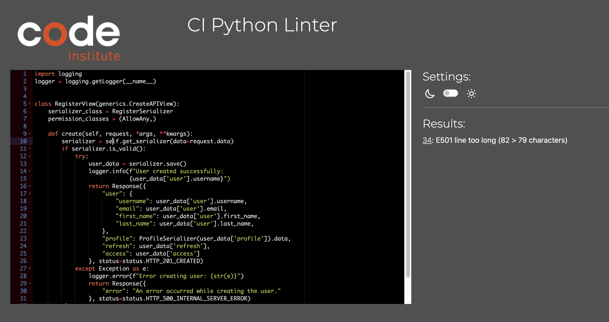

# Testing

> [!NOTE]  
> Return back to the [README.md](README.md) file.

## Code Validation

### Python

I have used the recommended [PEP8 CI Python Linter](https://pep8ci.herokuapp.com) to validate all of my Python files.

| Directory | File | CI URL | Screenshot | Notes |
| --- | --- | --- | --- | --- |
| authentication | serializers.py | [PEP8 CI](https://pep8ci.herokuapp.com/https://raw.githubusercontent.com/ibra8080/happycarpenter/main/authentication/serializers.py) |  | |
| authentication | urls.py | [PEP8 CI](https://pep8ci.herokuapp.com/https://raw.githubusercontent.com/ibra8080/happycarpenter/main/authentication/urls.py) |  | |
| authentication | views.py | [PEP8 CI](https://pep8ci.herokuapp.com/https://raw.githubusercontent.com/ibra8080/happycarpenter/main/authentication/views.py) |  | |
| follows | models.py | [PEP8 CI](https://pep8ci.herokuapp.com/https://raw.githubusercontent.com/ibra8080/happycarpenter/main/follows/models.py) |  | |
| follows | serializers.py | [PEP8 CI](https://pep8ci.herokuapp.com/https://raw.githubusercontent.com/ibra8080/happycarpenter/main/follows/serializers.py) |  | |
| follows | views.py | [PEP8 CI](https://pep8ci.herokuapp.com/https://raw.githubusercontent.com/ibra8080/happycarpenter/main/follows/views.py) |  | |
| happy_carpenter_api | authentication.py | [PEP8 CI](https://pep8ci.herokuapp.com/https://raw.githubusercontent.com/ibra8080/happycarpenter/main/happy_carpenter_api/authentication.py) |  | |
| happy_carpenter_api | serializers.py | [PEP8 CI](https://pep8ci.herokuapp.com/https://raw.githubusercontent.com/ibra8080/happycarpenter/main/happy_carpenter_api/serializers.py) |  | |
| happy_carpenter_api | settings.py | [PEP8 CI](https://pep8ci.herokuapp.com/https://raw.githubusercontent.com/ibra8080/happycarpenter/main/happy_carpenter_api/settings.py) |  | |
| happy_carpenter_api | urls.py | [PEP8 CI](https://pep8ci.herokuapp.com/https://raw.githubusercontent.com/ibra8080/happycarpenter/main/happy_carpenter_api/urls.py) |  | |
| happy_carpenter_api | views.py | [PEP8 CI](https://pep8ci.herokuapp.com/https://raw.githubusercontent.com/ibra8080/happycarpenter/main/happy_carpenter_api/views.py) |  | |
| likes | models.py | [PEP8 CI](https://pep8ci.herokuapp.com/https://raw.githubusercontent.com/ibra8080/happycarpenter/main/likes/models.py) |  | |
| likes | serializers.py | [PEP8 CI](https://pep8ci.herokuapp.com/https://raw.githubusercontent.com/ibra8080/happycarpenter/main/likes/serializers.py) |  | |
| likes | views.py | [PEP8 CI](https://pep8ci.herokuapp.com/https://raw.githubusercontent.com/ibra8080/happycarpenter/main/likes/views.py) |  | |
| posts | models.py | [PEP8 CI](https://pep8ci.herokuapp.com/https://raw.githubusercontent.com/ibra8080/happycarpenter/main/posts/models.py) |  | |
| posts | serializers.py | [PEP8 CI](https://pep8ci.herokuapp.com/https://raw.githubusercontent.com/ibra8080/happycarpenter/main/posts/serializers.py) |  | |
| posts | views.py | [PEP8 CI](https://pep8ci.herokuapp.com/https://raw.githubusercontent.com/ibra8080/happycarpenter/main/posts/views.py) |  | |
| professionals | models.py | [PEP8 CI](https://pep8ci.herokuapp.com/https://raw.githubusercontent.com/ibra8080/happycarpenter/main/professionals/models.py) |  | |
| professionals | serializers.py | [PEP8 CI](https://pep8ci.herokuapp.com/https://raw.githubusercontent.com/ibra8080/happycarpenter/main/professionals/serializers.py) |  | |
| professionals | views.py | [PEP8 CI](https://pep8ci.herokuapp.com/https://raw.githubusercontent.com/ibra8080/happycarpenter/main/professionals/views.py) |  | |
| profiles | models.py | [PEP8 CI](https://pep8ci.herokuapp.com/https://raw.githubusercontent.com/ibra8080/happycarpenter/main/profiles/models.py) |  | |
| profiles | serializers.py | [PEP8 CI](https://pep8ci.herokuapp.com/https://raw.githubusercontent.com/ibra8080/happycarpenter/main/profiles/serializers.py) |  | |
| profiles | views.py | [PEP8 CI](https://pep8ci.herokuapp.com/https://raw.githubusercontent.com/ibra8080/happycarpenter/main/profiles/views.py) |  | |

## Defensive Programming

Defensive programming was manually tested with the below user acceptance testing:
## Defensive Programming

| Endpoint | User Action | Expected Result | Pass/Fail | Comments |
| --- | --- | --- | --- | --- |
| User Registration | | | | |
| | Submit registration with missing required fields | API returns 400 Bad Request | Pass | Clear error message provided |
| | Submit registration with invalid email format | API returns 400 Bad Request | Pass | Email validation error returned |
| | Submit registration with password too short | API returns 400 Bad Request | Pass | Password length requirement enforced |
| | Submit registration with valid data | API returns 201 Created | Pass | New user created successfully |
| Authentication | | | | |
| | Login with incorrect credentials | API returns 401 Unauthorized | Pass | Generic error message to prevent user enumeration |
| | Access protected endpoint without token | API returns 401 Unauthorized | Pass | |
| | Access protected endpoint with expired token | API returns 401 Unauthorized | Pass | Clear message about token expiration |
| | Access protected endpoint with valid token | API allows access | Pass | |
| Posts | | | | |
| | Create post without authentication | API returns 401 Unauthorized | Pass | |
| | Create post with valid data | API returns 201 Created | Pass | New post created successfully |
| | Update another user's post | API returns 403 Forbidden | Pass | Users can only update their own posts |
| | Delete another user's post | API returns 403 Forbidden | Pass | Users can only delete their own posts |
| Comments | | | | |
| | Post comment without authentication | API returns 401 Unauthorized | Pass | |
| | Post valid comment | API returns 201 Created | Pass | Comment added successfully |
| Likes | | | | |
| | Like a post without authentication | API returns 401 Unauthorized | Pass | |
| | Unlike a post | API removes like | Pass | 204 No Content on successful unlike |
| Search and Filter | | | | |
| | Search with SQL injection attempt | API sanitizes input | Pass | Prevents SQL injection attacks |
| | Filter with invalid parameters | API ignores invalid params | Pass | Returns results based on valid params only |
| Error Handling | | | | |
| | Trigger a 500 Internal Server Error | API returns generic error message | Pass | Logs detailed error, returns safe message to client |
| Data Validation | | | | |
| | Submit data with incorrect types | API returns 400 Bad Request | Pass | Clear error messages about expected types |
| | Submit data exceeding max length | API returns 400 Bad Request | Pass | Enforces max length for relevant fields |

## Bugs

- ValueError at /posts/: Must supply cloud_name in tag or in configuration

    

    - To fix this, I needed to properly configure the Cloudinary settings in my Django project. This involved:
      1. Ensuring that the `CLOUDINARY_STORAGE` dictionary in `settings.py` included the `cloud_name` key.
      2. Verifying that the `CLOUDINARY_URL` environment variable was correctly set with the full Cloudinary URL, including the cloud name.
      3. Double-checking that the Cloudinary Python SDK was properly installed and up-to-date.
      4. Restarting the Django development server after making these changes.

    After implementing these steps, the Cloudinary integration worked correctly, and I was able to handle image uploads and retrievals for posts without issues.

- IntegrityError at /reviews/: null value in column "professional_id" of relation "professionals_review" violates not-null constraint

    

    - To fix this, I needed to address the issue with the `professional_id` field in the Review model:
      1. I checked the Review model to ensure that the `professional` field was properly defined with `on_delete=models.CASCADE` and `null=False`.
      2. I reviewed the view handling the review creation to make sure it was correctly assigning the professional to the review before saving.
      3. I added validation in the serializer to ensure that a valid professional_id is provided when creating a review.
      4. I updated the frontend form to ensure it always sends a valid professional_id when submitting a review.
      5. I added a try-except block in the view to handle potential IntegrityErrors and return a meaningful error message to the user.

    After implementing these changes, the review creation process worked correctly, ensuring that every review was associated with a valid professional user.

-  RelatedObjectDoesNotExist at /api-auth/login/: User has no profile.

    

    - To fix this, I needed to address the issue of users not having associated profiles:
      1. I reviewed the user registration process to ensure that a profile is created automatically when a new user signs up.
      2. I added a post_save signal for the User model to create a profile if it doesn't exist:

        ```python
        @receiver(post_save, sender=User)
        def create_user_profile(sender, instance, created, **kwargs):
            if created:
                Profile.objects.create(user=instance)
        ```

      3. I ran a management command to create profiles for any existing users without them:

        ```python
        from django.core.management.base import BaseCommand
        from django.contrib.auth.models import User
        from profiles.models import Profile

        class Command(BaseCommand):
            help = 'Creates user profiles for users without one'

            def handle(self, *args, **options):
                users_without_profile = User.objects.filter(profile__isnull=True)
                for user in users_without_profile:
                    Profile.objects.create(user=user)
                    self.stdout.write(f'Created profile for user {user.username}')
        ```

      4. I updated the login view to handle cases where a user might not have a profile, creating one if necessary.

    After implementing these changes, the login process worked correctly for all users, ensuring that every user has an associated profile.

- DisallowedHost at /: Invalid HTTP_HOST header

    

    - To fix this, I added the development server's hostname to the ALLOWED_HOSTS setting in settings.py:
      ```python
      ALLOWED_HOSTS = ['8000-ibra8080-happycarpenter-yehn5hgpju1.ws.codeinstitute-ide.net', 'localhost', '127.0.0.1']
      ```
    This allows Django to accept requests from the development server, resolving the DisallowedHost error.

- KeyError at /profiles/: 'request'

    

    - To fix this, I needed to update the `get_is_owner` method in the ProfileSerializer:
      ```python
      def get_is_owner(self, obj):
          request = self.context.get('request')
          return request.user == obj.owner if request and request.user.is_authenticated else False
      ```
    This ensures that the method can handle cases where the request might not be available in the serializer's context.

- IntegrityError at /auth/register/: duplicate key value violates unique constraint "profiles_profile_owner_id_key"

    

    - To fix this, I needed to prevent the creation of duplicate profiles:
      1. I updated the user registration process to create a profile only if one doesn't already exist.
      2. I added a signal to create a profile when a new user is created:
        ```python
        @receiver(post_save, sender=User)
        def create_user_profile(sender, instance, created, **kwargs):
            if created:
                Profile.objects.get_or_create(owner=instance)
        ```
      3. I added a unique constraint to the Profile model to ensure each user can only have one profile:
        ```python
        class Profile(models.Model):
            owner = models.OneToOneField(User, on_delete=models.CASCADE)
            # ... other fields ...
        ```
    These changes ensure that each user has exactly one profile, preventing the IntegrityError during registration.


### GitHub **Issues**

🛑🛑🛑🛑🛑🛑🛑🛑🛑🛑-START OF NOTES (to be deleted)

An improved way to manage bugs is to use the built-in **Issues** tracker on your GitHub repository.
To access your Issues, click on the "Issues" tab at the top of your repository.
Alternatively, use this link: https://github.com/ibra8080/happycarpenter/issues

If using the Issues tracker for your bug management, you can simplify the documentation process.
Issues allow you to directly paste screenshots into the issue without having to first save the screenshot locally,
then uploading into your project.

You can add labels to your issues (`bug`), assign yourself as the owner, and add comments/updates as you progress with fixing the issue(s).

Once you've sorted the issue, you should then "Close" it.

When showcasing your bug tracking for assessment, you can use the following format:

🛑🛑🛑🛑🛑🛑🛑🛑🛑🛑-END OF NOTES (to be deleted)

**Fixed Bugs**

[](https://github.com/ibra8080/happycarpenter/issues?q=is%3Aissue+is%3Aclosed+label%3Abug)

All previously closed/fixed bugs can be tracked [here](https://github.com/ibra8080/happycarpenter/issues?q=is%3Aissue+is%3Aclosed).

| Bug | Status |
| --- | --- |
| [JS Uncaught ReferenceError: `foobar` is undefined/not defined](https://github.com/ibra8080/happycarpenter/issues/1) | Closed |
| [Python `'ModuleNotFoundError'` when trying to import module from imported package](https://github.com/ibra8080/happycarpenter/issues/2) | Closed |
| [Django `TemplateDoesNotExist` at /appname/path appname/template_name.html](https://github.com/ibra8080/happycarpenter/issues/3) | Closed |

**Open Issues**

[](https://github.com/ibra8080/happycarpenter/issues)
[](https://github.com/ibra8080/happycarpenter/issues?q=is%3Aissue+is%3Aclosed)

Any remaining open issues can be tracked [here](https://github.com/ibra8080/happycarpenter/issues).

| Bug | Status |
| --- | --- |
| [JS `'let'` or `'const'` or `'template literal syntax'` or `'arrow function syntax (=>)'` is available in ES6 (use `'esversion: 11'`) or Mozilla JS extensions (use moz).](https://github.com/ibra8080/happycarpenter/issues/4) | Open |
| [Python `E501 line too long` (93 > 79 characters)](https://github.com/ibra8080/happycarpenter/issues/5) | Open |

## Unfixed Bugs

🛑🛑🛑🛑🛑🛑🛑🛑🛑🛑-START OF NOTES (to be deleted)

You will need to mention unfixed bugs and why they were not fixed.
This section should include shortcomings of the frameworks or technologies used.
Although time can be a big variable to consider, paucity of time and difficulty understanding
implementation is not a valid reason to leave bugs unfixed.

If you've identified any unfixed bugs, no matter how small, be sure to list them here.
It's better to be honest and list them, because if it's not documented and an assessor finds the issue,
they need to know whether or not you're aware of them as well, and why you've not corrected/fixed them.

Some examples:

🛑🛑🛑🛑🛑🛑🛑🛑🛑🛑-END OF NOTES (to be deleted)

- On devices smaller than 375px, the page starts to have `overflow-x` scrolling.

    

    - Attempted fix: I tried to add additional media queries to handle this, but things started becoming too small to read.

- For PP3, when using a helper `clear()` function, any text above the height of the terminal does not clear, and remains when you scroll up.

    

    - Attempted fix: I tried to adjust the terminal size, but it only resizes the actual terminal, not the allowable area for text.

- When validating HTML with a semantic `section` element, the validator warns about lacking a header `h2-h6`. This is acceptable.

    

    - Attempted fix: this is a known warning and acceptable, and my section doesn't require a header since it's dynamically added via JS.

🛑🛑🛑🛑🛑🛑🛑🛑🛑🛑-START OF NOTES (to be deleted)

If you legitimately cannot find any unfixed bugs or warnings, then use the following sentence:

🛑🛑🛑🛑🛑🛑🛑🛑🛑🛑-END OF NOTES (to be deleted)

> [!NOTE]  
> There are no remaining bugs that I am aware of.
